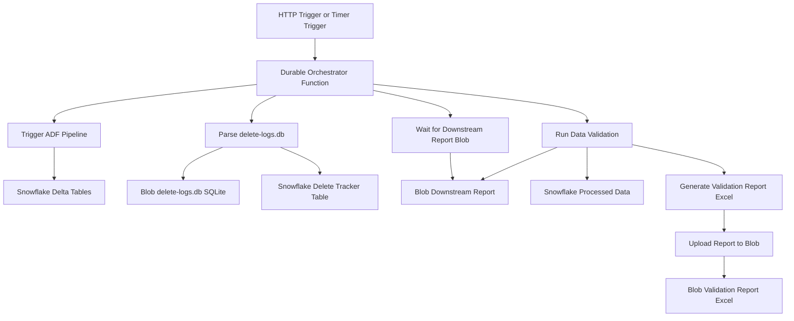

Here’s a **Mermaid diagram** to visualize your architecture using **Azure Durable Functions orchestration**, ADF, Snowflake, and Azure Blob.

---

### ✅ **Architecture: Azure Durable Functions Orchestrating Salesforce → Snowflake → Validation Flow**

---

### 📝 How to Use This

You can render this in:

* [Mermaid Live Editor](https://mermaid.live/edit)
* Markdown files in VS Code with Mermaid support
* GitHub README (within a supported code block)
* Azure DevOps Wikis

---

Let me know if you want a **static image (PNG/SVG)** version or a version that includes **error-handling/monitoring paths** (like retries, alerts, etc.).

